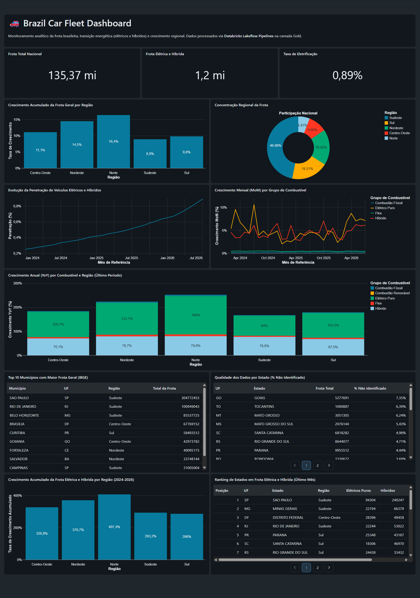

# 🚗 Brazil Car Fleet Analytics — Databricks Medallion Architecture

<div align="center">

[](https://databricks.com)
[](https://github.com/databrickslabs)
[](https://spark.apache.org)
[](https://www.databricks.com/product/unity-catalog)
[](https://docs.astral.sh/uv/)
[](https://github.com/features/actions)

**Plataforma de Engenharia de Dados End-to-End para Análise da Frota Veicular Brasileira, Eletrificação (EV/Híbridos) e Crescimento Regional.**

*Fontes Oficiais: SENATRAN (Ministério dos Transportes) & Receita Federal do Brasil (RFB)*

<br>

[](assets/Brazil%20Car%20Fleet%20Dashboard%202026-08-28%2019_22.pdf)

<sub>📊 *Visualização do Databricks AI/BI Dashboard. Clique na imagem para abrir o relatório completo em PDF.*</sub>

</div>

---

## 📌 Visão Geral do Projeto

Este projeto implementa uma plataforma corporativa de dados orientada a eventos (**Event-Driven DataOps**) no ecossistema **Databricks**, cobrindo todo o ciclo de vida dos dados:
1. **Extração e Ingestão Incremental:** Automação em Python com Astral `uv` e Docker, agendada via GitHub Actions.
2. **Arquitetura Medalhão Declarativa:** Construída com **Databricks Lakeflow Pipelines** (Spark Declarative Pipelines), garantindo validações de qualidade por linha via Expectations e governança no **Unity Catalog**.
3. **Modelagem Dimensional (Star Schema):** 100% de correspondência com a malha municipal do IBGE (5.570 municípios) e deduplicação canônica com idempotência estrita.
4. **Infraestrutura como Código (IaC):** Versionamento de pipelines, orquestração e dashboards via **Databricks Asset Bundles (DAB)** com isolamento multi-ambiente (`dev` e `prod`).
5. **Business Intelligence:** Painel analítico nativo no **Databricks AI/BI (Lakeview)**.

> 🤖 **Desenvolvido com Databricks AI Dev Kit:** A arquitetura adotou rigorosamente os padrões oficiais de engenharia da Databricks através das skills especializadas (`databricks-pipelines`, `databricks-jobs`, `databricks-dabs`, `databricks-aibi-dashboards`, `databricks-unity-catalog`).

---

## 📈 Principais Insights do Dashboard

<div align="center">

| Indicador Analítico | Métrica Consolidada | Destaque Regional / Tendência |
|---|---|---|
| **Crescimento de Eletrificados (2024–2026)** | **+718,3% (Brasil)** | Aceleração expressiva no **Norte (+914,7%)** e **Nordeste (+841,4%)** |
| **Líder Nacional em Eletrificação** | **São Paulo (SP)** | **669.102 veículos** (188k elétricos puros + 480k híbridos) |
| **Top 2 e 3 Estados em Frota EV/Híbrida** | **Minas Gerais (MG) e DF** | **177.146** (MG) e **155.708** (DF) veículos eletrificados |
| **Concentração da Frota Total** | **Região Sudeste** | Concentra **48,9%** de todos os veículos automotores do país |
| **Qualidade e Identificação** | **> 99,8% Classificado** | Apenas ~0,15% da frota classificada como *Sem Informação* |

*Confira o relatório visual completo exportado em:* [**`assets/Brazil Car Fleet Dashboard 2026-08-28 19_22.pdf`**](assets/Brazil%20Car%20Fleet%20Dashboard%202026-08-28%2019_22.pdf)

</div>

---

## 📐 Arquitetura da Solução

```
 ┌────────────────────────┐
 │  GitHub Actions / uv   │  (Ingestão agendada todo dia 15 ou sob demanda)
 └───────────┬────────────┘
             │ 1. Download do Senatran, validação de schema e upload em CSV
             ▼
 ┌────────────────────────────────────────────────────────────────────────┐
 │  Unity Catalog Volume (/Volumes/.../fleet_raw/)                        │
 └───────────────────────────┬────────────────────────────────────────────┘
                             │ 2. Disparo por evento (FileArrivalTrigger)
                             ▼
 ┌────────────────────────────────────────────────────────────────────────┐
 │  Databricks Workflow Orchestration (Serverless)                        │
 │                                                                        │
 │  ┌─────────────────────────┐                                           │
 │  │ Pipeline 1: Raw → Bronze│ Auto Loader streaming + Data Quality      │
 │  │                         │ frota_raw, frota_quarentena, rfb_raw      │
 │  └────────────┬────────────┘                                           │
 │               ▼                                                        │
 │  ┌─────────────────────────┐                                           │
 │  │ Pipeline 2: Bronze→Silver│ Star Schema (Dimensões + Fato 100% IBGE) │
 │  │                         │ dim_data, dim_municipio, fato_frota       │
 │  └────────────┬────────────┘                                           │
 │               ▼                                                        │
 │  ┌─────────────────────────┐                                           │
 │  │ Pipeline 3: Silver→Gold │ Agregações Analíticas e KPIs (MoM/YoY)    │
 │  └────────────┬────────────┘                                           │
 └───────────────┼────────────────────────────────────────────────────────┘
                 │ 3. Atualização automática
                 ▼
 ┌────────────────────────────────────────────────────────────────────────┐
 │  📊 Databricks AI/BI Dashboard (Brazil Car Fleet Dashboard)            │
 └────────────────────────────────────────────────────────────────────────┘
```

---

## 🏛️ Governança e Modelo de Dados (Unity Catalog)

A governança opera com isolamento multi-ambiente via Databricks Asset Bundles:
* **Desenvolvimento:** Catálogo `brazil_car_fleet_dev` (testes isolados e prototipação).
* **Produção:** Catálogo `brazil_car_fleet` (dados homologados e consumo de BI).

```
brazil_car_fleet (catalog)
├── raw_data (schema)
│   ├── fleet_raw/          ← Volume: CSVs particionados de frota
│   └── rfb_municipios_raw/ ← Volume: Base territorial da Receita Federal (TOM/IBGE)
├── bronze (schema)
│   ├── frota_raw           ← Tabela streaming (Auto Loader + schema estrito)
│   ├── frota_quarentena    ← Quarentena de registros inválidos
│   └── rfb_municipios_raw  ← Cadastro oficial de municípios
├── silver (schema)
│   ├── dim_data            ← Dimensão calendário (ano, mês, data_referencia)
│   ├── dim_municipio       ← 5.570 municípios normalizados com código IBGE e Região
│   ├── dim_combustivel     ← Agrupamento: Elétrico Puro, Híbrido, Flex, Fóssil, Renovável
│   └── fato_frota          ← Fato transacional mensal com surrogate keys e dt_ingestao
└── gold (schema)
    ├── frota_eletrica_e_hibrida_evolucao           ← Tendência mensal de eletrificação
    ├── frota_por_grupo_combustivel_regiao          ← Volume por macrorregião × mês
    ├── frota_crescimento_mom_por_combustivel       ← Variação percentual mês a mês
    ├── frota_crescimento_yoy_por_combustivel_regiao← Variação anual comparativa
    ├── frota_crescimento_por_regiao                ← Crescimento acumulado no período
    ├── frota_municipio_ranking                     ← Top municípios por volume e tipo
    └── frota_qualidade_dados                       ← Auditoria de registros não identificados
```

---

## 📁 Estrutura do Repositório

```
frota-veiculos-brasil/
├── .github/workflows/
│   ├── ci_validation.yml        # Validação de código e bundles em PRs
│   ├── deploy_prod.yml          # Deploy contínuo em Produção no merge na main
│   └── ingestion_monthly.yml    # Ingestão mensal agendada via Service Principal
│
├── assets/
│   └── Brazil Car Fleet Dashboard 2026-08-28 19_22.pdf # Export do Dashboard Lakeview
│
├── ingestion/                       # Módulo de Extração e Ingestão em Python
│   ├── Dockerfile                   # Imagem Docker conteinerizada (Python 3.13 + uv)
│   ├── pyproject.toml / uv.lock     # Gerenciamento de dependências ultra-rápido
│   └── src/
│       ├── extract_fleet.py         # Scraping e download de dados do Senatran
│       ├── extract_municipios.py    # Download territorial da Receita Federal
│       ├── validate.py              # Validação de schema e integridade pré-carga
│       └── load.py                  # Upload streaming para Volumes do Unity Catalog
│
├── databricks/                      # Infraestrutura como Código (DAB)
│   ├── databricks.yml               # Definição dos targets dev e prod
│   ├── resources/                   # Declaração dos pipelines, jobs e dashboard
│   └── src/
│       ├── pipeline/                # Código dos pipelines (raw_to_bronze, bronze_to_silver, silver_to_gold)
│       └── dashboard/               # Especificação JSON do AI/BI Dashboard
│
├── project.md                       # Especificação técnica e arquitetura de dados
└── README.md                        # Documentação executiva do projeto
```

---

## 🛠️ Como Executar o Projeto

### Pré-requisitos
- Python 3.11+ e [uv](https://docs.astral.sh/uv/)
- [Databricks CLI](https://docs.databricks.com/dev-tools/cli/index.html) (`>= 0.288.0`)
- Docker (opcional)

### 1. Ingestão de Dados Local

```bash
cd ingestion
uv sync

# Executar carga incremental do mês anterior:
uv run python src/load.py --previous-month

# Ou carregar um mês/ano específico:
uv run python src/load.py --year 2026 --month 7
```

### 2. Deploy da Infraestrutura com DAB

```bash
cd databricks

# Validar sintaxe e integridade dos recursos
databricks bundle validate --target dev

# Fazer o deploy no catálogo de desenvolvimento
databricks bundle deploy --target dev

# Disparar o workflow sob demanda
databricks bundle run orchestration_frota --target dev
```

---

## 🚀 Esteira de CI/CD e GitOps

A plataforma conta com automação completa via **GitHub Actions**:

1. **`ci_validation.yml` (Pull Requests):** Valida tipagem, testes de integridade e executa `databricks bundle validate` em `dev` e `prod`.
2. **`deploy_prod.yml` (Deploy em Produção):** Disparado automaticamente no merge para a branch `main`, executando `databricks bundle deploy --target prod` via Service Principal (OAuth M2M).
3. **`ingestion_monthly.yml` (Ingestão Agendada):** Execução agendada no dia 15 de cada mês (ou manual com seleção de ano/mês) para alimentar os dados em Produção.

---

### 🔑 Segredos do GitHub Actions (Repository Secrets)

Cadastre em **Settings ➔ Secrets and variables ➔ Actions**:

| Secret | Descrição | Exemplo |
|---|---|---|
| `DATABRICKS_HOST` | URL do workspace Databricks | `https://dbc-xxxx.cloud.databricks.com/` |
| `DATABRICKS_CLIENT_ID` | Application ID do Service Principal | `xxxxxxxx-xxxx-xxxx-xxxx-xxxxxxxxxxxx` |
| `DATABRICKS_CLIENT_SECRET` | OAuth Secret gerado no Databricks | `dapixxxxxxxxxxxxxxxxxxxxxxxx` |

---

## 👨‍💻 Autor

Desenvolvido por **Matheus Gentil**.

[](https://linkedin.com/in/matheusvgentil)
[](https://github.com/mvgentil)
